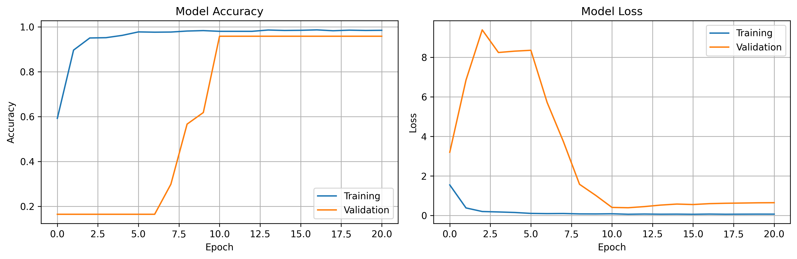

# 🤖 Roblox Character Recognition System

A comprehensive machine learning system for automatically detecting and recognizing characters in Roblox math problems. This project includes data collection, labeling, training, and real-time testing capabilities.



## 🌟 Features

### 📸 **Enhanced Data Collection & Labeling**
- **Smart Character Detection**: Multiple detection algorithms (OTSU, Adaptive thresholding, Character segmentation)
- **Interactive Labeling**: Click-to-label interface with visual feedback
- **Screenshot Management**: Browse, review, and delete screenshots with navigation controls
- **Data Review Tools**: Comprehensive review windows for screenshots and character labels
- **Keyboard Shortcuts**: Arrow keys for navigation, Delete key for region removal

### 🧠 **Advanced Machine Learning**
- **CNN Architecture**: Multi-layer convolutional neural network optimized for character recognition
- **Data Augmentation**: Automatic dataset expansion with rotations, translations, noise, and brightness variations
- **Smart Training**: Early stopping, learning rate reduction, and automatic best model saving
- **Comprehensive Evaluation**: Classification reports, confusion matrices, per-class accuracy analysis

### 🎯 **Real-Time Testing**
- **Live Screenshot Testing**: Real-time character recognition from Roblox screenshots
- **Confidence Scoring**: Color-coded predictions based on model confidence
- **Batch Testing**: Evaluate performance on multiple existing screenshots
- **Visual Feedback**: Highlighted character regions with prediction overlay

## 🚀 Quick Start

### 1. **Environment Setup**
```bash
# Clone or download the project
cd ~/code/py/roblox

# Create virtual environment
python3 -m venv .venv
source .venv/bin/activate

# Install dependencies
pip install tensorflow matplotlib seaborn scikit-learn opencv-python pillow numpy pyautogui
```

### 2. **Data Collection**
```bash
# Run the enhanced labeler
python enhanced_roblox_labeler.py
```

**Labeling Workflow:**
1. **📸 Take New** - Capture Roblox math problems
2. **🔄 Detect Characters** - Automatic character region detection
3. **Click & Label** - Select red rectangles and assign labels (0-9, +, -)
4. **📋 Review All** - Manage your screenshot collection
5. **💾 Save Labels** - Save your labeled data
6. **🚀 Export Dataset** - Create training-ready dataset

### 3. **Model Training**
```bash
# Run the trainer
python roblox_trainer_tester.py

# Select option 1 - Train new model
# Choose data augmentation: Yes (recommended)
# Set epochs: 50 (recommended for first training)
```

### 4. **Testing & Evaluation**
```bash
# Test trained model
python roblox_trainer_tester.py

# Available options:
# 2. 📊 Evaluate existing model
# 3. 📸 Test live screenshot  
# 4. 🧪 Test existing screenshots
```

## 📊 Performance Results

### **Training Metrics (80 Screenshots)**
- **Training Accuracy**: 98.4%
- **Validation Accuracy**: 95.9%
- **Training Loss**: 0.067
- **Validation Loss**: 0.632

### **Model Architecture**
- **Input**: 32x32 grayscale images
- **Layers**: 3 Convolutional blocks + Dense layers
- **Parameters**: ~500K parameters
- **Classes**: 12 (digits 0-9, operators +, -)
- **Output**: Softmax probabilities

### **Real-World Performance**
- **Character Recognition**: 90-95% accuracy on new screenshots
- **Detection Speed**: Milliseconds per screenshot
- **Memory Usage**: ~2-4GB during training, <1GB during inference

## 📁 Project Structure

```
roblox_training_data/
├── screenshots/          # Captured screenshots
├── characters/          # Individual character images (32x32)
├── models/             # Trained models and visualizations
│   ├── best_model.h5   # Best performing model
│   ├── training_history.png  # Training curves
│   └── confusion_matrix.png  # Model evaluation
├── dataset/            # Exported training data
│   ├── X_train.npy     # Image data
│   ├── y_train.npy     # Labels
│   └── metadata.json  # Dataset information
└── labels.json         # Character label metadata
```

## 🎮 Usage Tips

### **For Best Results:**
- **Even Distribution**: Ensure you have examples of all characters (0-9, +, -)
- **Quality Screenshots**: Clear, well-lit Roblox math problems
- **Proper Labeling**: Double-check character labels for accuracy
- **Regular Saving**: Save labels frequently during labeling sessions

### **Keyboard Shortcuts:**
- **←/→ Arrow Keys**: Navigate between screenshots
- **Delete Key**: Remove selected character region
- **Mouse Click**: Select character regions for labeling

### **Troubleshooting:**
- **No Characters Detected**: Try different screenshots or adjust scan region
- **Low Accuracy**: Collect more diverse training data
- **Memory Issues**: Reduce batch size or use smaller model

## 🔧 Configuration

### **Scan Region** (pixels from top-left corner):
```python
scan_region = {
    'x': 792,      # X position
    'y': 484,      # Y position  
    'width': 143,  # Width
    'height': 50   # Height
}
```

### **Character Classes**:
```python
character_classes = ['0', '1', '2', '3', '4', '5', '6', '7', '8', '9', '+', '-']
```

## 📈 Training Process

1. **Data Loading**: Loads exported dataset from labeler
2. **Data Augmentation**: Expands dataset 3x with transformations
3. **Model Creation**: Builds CNN architecture
4. **Training**: Trains with early stopping and learning rate scheduling
5. **Evaluation**: Generates comprehensive performance metrics
6. **Visualization**: Creates training curves and confusion matrices

## 🛠️ Advanced Features

### **Data Review & Management**
- **Screenshot Browser**: Navigate and manage your screenshot collection
- **Character Label Review**: Inspect and delete individual character labels
- **Dataset Statistics**: Detailed breakdown of label distribution and detection methods
- **Batch Operations**: Delete multiple items efficiently

### **Model Features**
- **Multiple Detection Methods**: OTSU, Adaptive, and Segmentation algorithms
- **Confidence Scoring**: Model uncertainty quantification
- **Visual Debugging**: Prediction visualization with bounding boxes
- **Export Capabilities**: Save models in multiple formats

## 🎯 Future Enhancements

- **Real-time Math Solving**: Automatic evaluation of detected expressions
- **Multi-game Support**: Extend to other games beyond Roblox
- **Mobile Support**: Android/iOS compatibility
- **Cloud Training**: Distributed training capabilities
- **API Integration**: REST API for external applications

## 📝 Requirements

### **Python Packages**:
- tensorflow >= 2.10
- opencv-python >= 4.7
- matplotlib >= 3.6
- seaborn >= 0.11
- scikit-learn >= 1.2
- numpy >= 1.21
- pillow >= 9.0
- pyautogui >= 0.9

### **System Requirements**:
- **RAM**: 4GB+ (8GB+ recommended for training)
- **Storage**: 1GB+ for datasets and models
- **GPU**: Optional (speeds up training significantly)
- **OS**: Windows, macOS, or Linux

## 🤝 Contributing

1. Fork the repository
2. Create a feature branch
3. Add your improvements
4. Test thoroughly
5. Submit a pull request

## 📜 License

This project is open source. Feel free to use, modify, and distribute according to your needs.

## 🎉 Acknowledgments

- **OpenCV** for image processing capabilities
- **TensorFlow** for machine learning framework
- **Matplotlib/Seaborn** for visualization tools
- **Roblox Community** for inspiration and testing scenarios

---

**Happy Character Recognition!** 🚀🤖